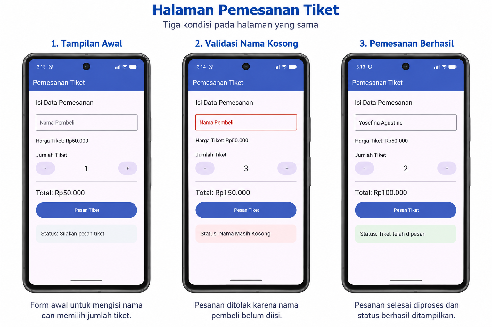

# Tugas Pemesanan Tiket, State Hoisting dan LaunchedEffect

**Nama:** Yosefina Agustine K. Ofong  
**NIM:** 245150400111030

## 📝 Deskripsi

### Tugas Modul: [Lihat Laporan Modul 4](Modul_PAM_4.pdf)

Aplikasi pemesanan tiket sederhana yang menerapkan State Hoisting,
LaunchedEffect, dan rememberSaveable menggunakan Jetpack Compose.

State harga tiket, jumlah tiket, dan nama pembeli dikelola pada
parent composable `TiketParent`. Child composable `TiketContent`
menampilkan data dan meneruskan interaksi pengguna melalui callback.

## ⚙️ Fitur

- Mengisi nama pembeli.
- Menampilkan harga tiket sebesar Rp50.000.
- Menambah dan mengurangi jumlah tiket, minimal 1 tiket.
- Menghitung total harga berdasarkan jumlah tiket.
- Menampilkan status "Nama Masih Kosong" jika memesan tanpa mengisi nama.
- Menampilkan status "Memproses pesanan..." selama 5 detik,
  kemudian berubah menjadi "Tiket telah dipesan".
- Menonaktifkan input dan tombol selama pemesanan diproses.
- Mempertahankan state ketika layar dirotasi.

## 📸 Screenshot Hasil

## 🛠️ Techstack

- Kotlin
- Jetpack Compose
- Material 3
- Kotlin Coroutines
- Android Studio

## 🔄 Pengelolaan State dan Side Effect

- **State Hoisting:** state disimpan di parent dan diteruskan ke child
  melalui parameter. Perubahan dilakukan melalui callback.
- **mutableStateOf:** membuat state yang dapat diamati Compose
  sehingga perubahan nilainya memperbarui tampilan.
- **rememberSaveable:** menyimpan state agar dapat dipulihkan
  ketika activity dibuat ulang, seperti saat rotasi layar.
- **LaunchedEffect:** menjalankan validasi dan simulasi pemesanan
  ketika pengguna menekan tombol Pesan Tiket.
- **delay:** menunggu proses pemesanan tanpa memblokir UI.
  Waktu selesai disimpan agar rotasi tidak mengulang durasi
  pemrosesan dari awal.

> Pemesanan merupakan simulasi lokal dan belum terhubung ke server.